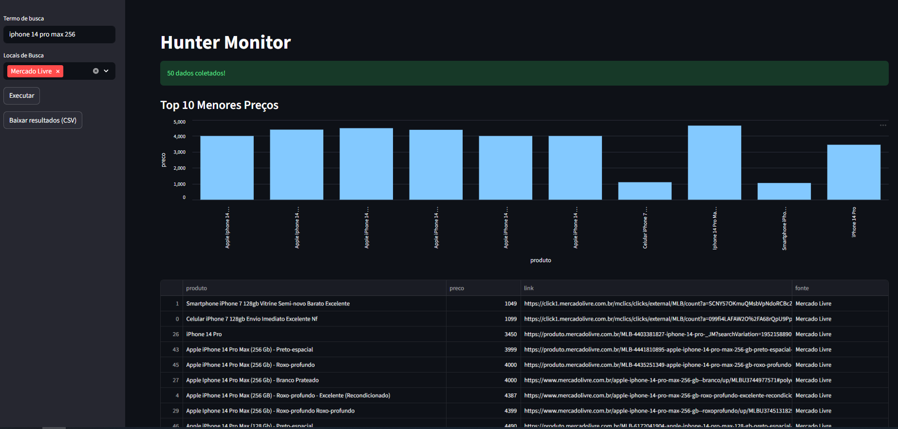

# RPA & Data Intelligence
Projeto de RPA (Robotic Process Automation) desenvolvida em Python que automatiza a coleta, limpeza e análise de preços em e-commerces no Mercado Livre. O objetivo é transformar dados brutos de busca em inteligência de mercado em tempo real.

## Funcionalidades
- **Web Scraping Híbrido**: Utiliza **Selenium** para navegação e **BeautifulSoup** para extração de dados em alta performance.
- **Tratamento de Dados**: Pipeline automático com **Pandas** para conversão de moedas, remoção de duplicatas e filtragem de outliers (anúncios irrelevantes).
- **Interface Interativa**: Dashboard construído com **Streamlit** para visualização de métricas e gráficos de distribuição.
- **Exportação**: Geração de relatórios em CSV para integração com ferramentas de BI.

## Tecnologias Utilizadas
- Linguagem: Python
- Automação: Selenium WebDriver
- Análise: Pandas
- Interface: Streamlit
- Gráficos: Plotly / Streamlit Charts